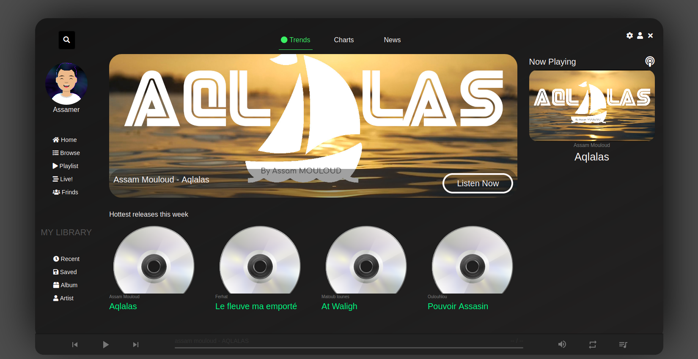

# Kabyle Music Template

This is My Progect, Littel webSite Streaming Music About Berber Kabyle Music . 
You can Use it, it free and OpenSource 

### About Langage Programing

## Music Include
<a href='dist/audio/album/assam_mouloud/Aqlalas.mp3' >ASSAM Mouloud - Aqlalas</a> 
<a href='dist/audio/album/assam_mouloud/ASSAM Mouloud - Afalku.mp3' >ASSAM Mouloud - Afalku</a> 
<a href='dist/audio/album/assam_mouloud/ASSAM MOULOUD  - Am doro.mp3' >ASSAM Mouloud - Am doro</a> 
<a href='dist/audio/album/assam_mouloud/ASSAM Mouloud - Anwa id abrid.mp3' >ASSAM Mouloud - Anwa id abrid</a> 
<a href='dist/audio/album/assam_mouloud/Assam Mouloud Tameslayt.mp3' >ASSAM Mouloud - Tameslayt</a> 

## License
Free OpenSource 

## Folow Me @assamer

